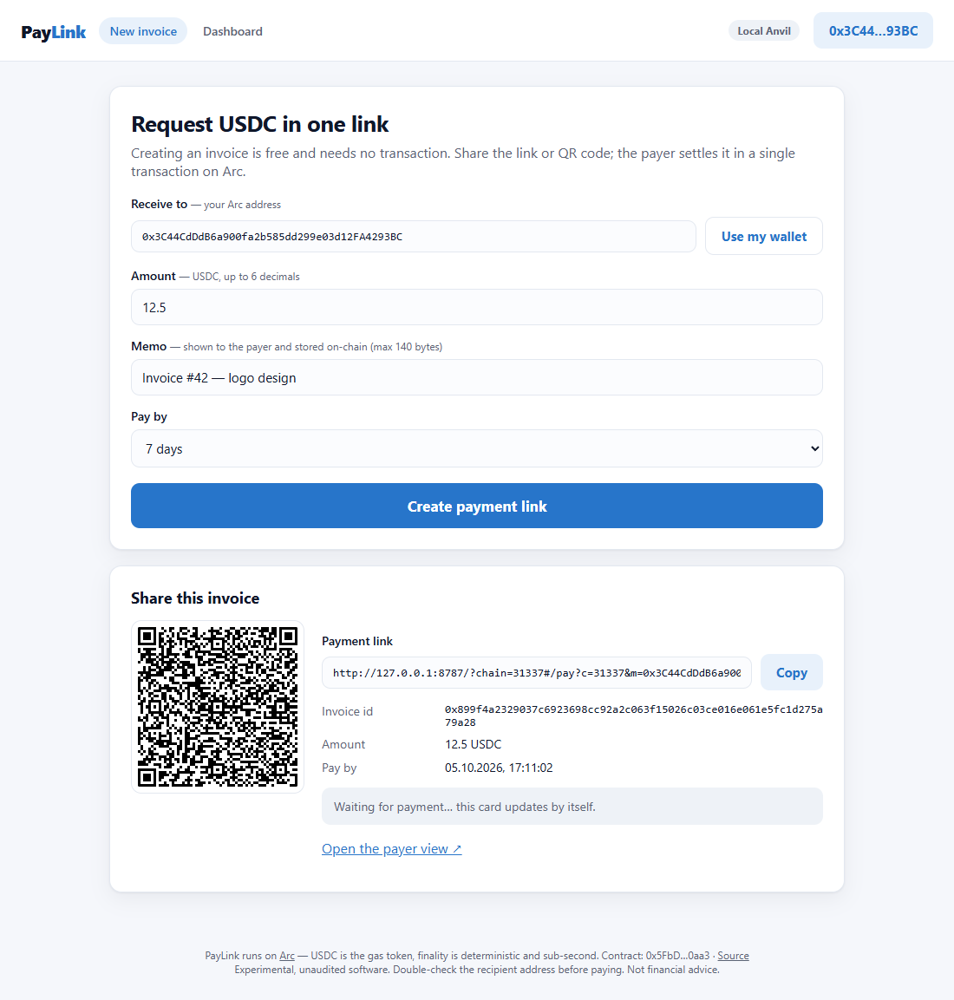
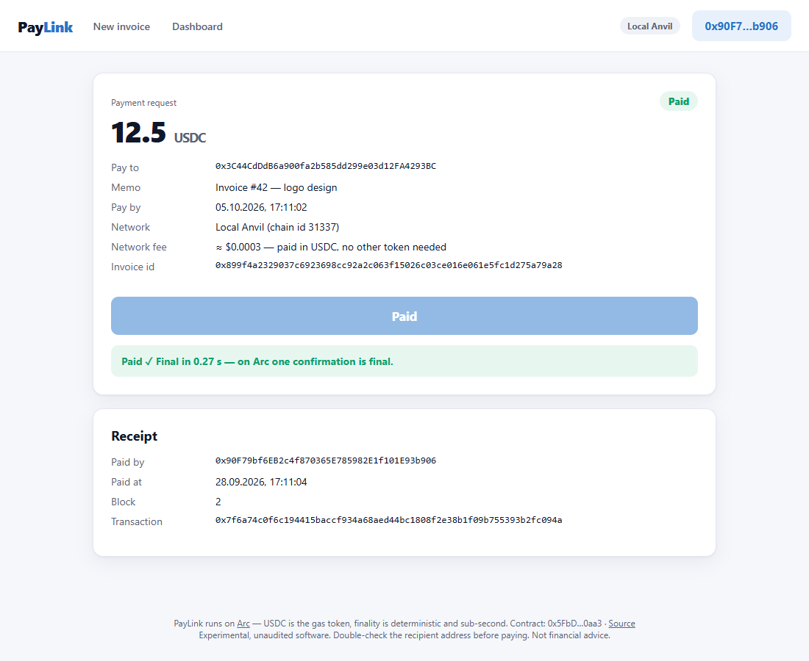
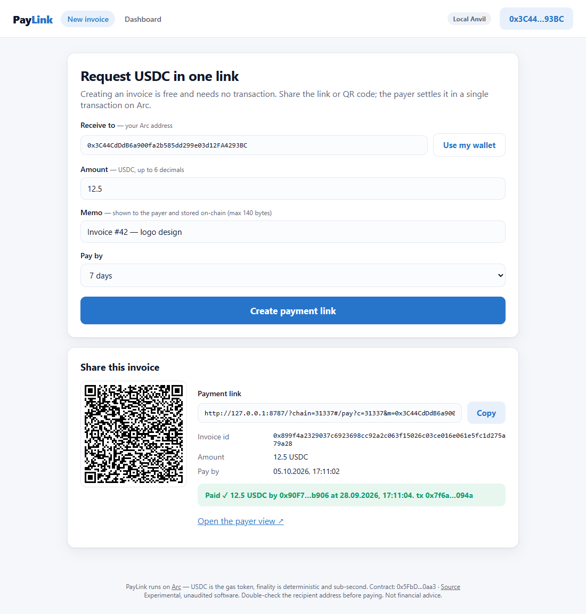
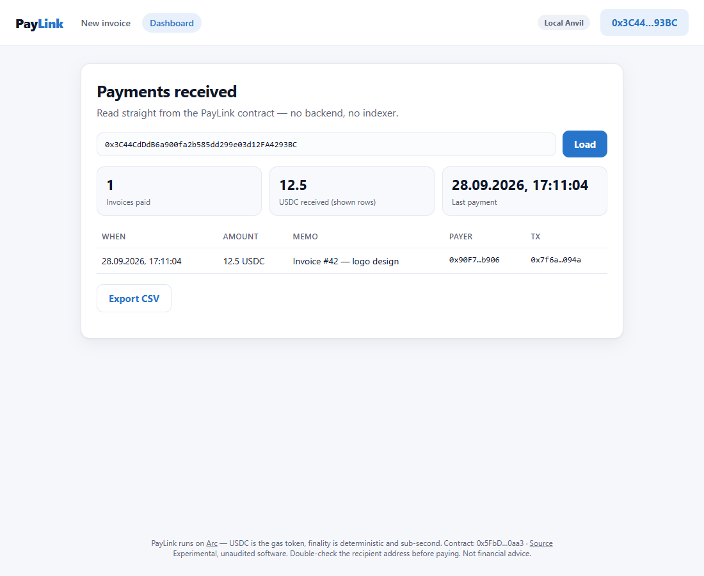

# PayLink — USDC invoices in one link, settled in one transaction on Arc

PayLink turns a USDC payment request into a link and a QR code. Creating an invoice costs nothing and
needs no transaction. The payer opens the link and pays in **one transaction**: USDC is Arc's native
token, so the invoice is paid with `msg.value` directly, with no ERC-20 approval step. The contract
forwards the funds to the merchant in the same call and writes an on-chain receipt. Arc's
deterministic finality means the merchant's page flips to **Paid** about a second later, and that
receipt is final.

| | |
|---|---|
| **Live app** | `https://Minkhanov.github.io/paylink-arc/` <!-- TODO after GitHub Pages deploy --> |
| **Contract (Arc mainnet, chain 5042)** | `0x…` → `https://explorer.arc.io/address/0x…` <!-- TODO after deploy --> |
| **Network** | Arc mainnet · RPC `https://rpc.mainnet.arc.io` · Explorer `https://explorer.arc.io` |
| **Status** | Experimental. Unaudited. Please use small amounts. |

## Demo

<!-- TODO: replace with a GIF or video recorded on Arc mainnet -->
`docs/demo.gif` (placeholder, to be recorded on mainnet)

Screenshots from the automated end-to-end run on a local node (`e2e/test_e2e.py`):

| Create an invoice (no transaction) | Pay in one transaction | Merchant sees "Paid" by itself | Dashboard |
|---|---|---|---|
|  |  |  |  |

## What it does

1. **Merchant** enters their address, an amount, a memo and an optional deadline, then gets a link and a QR code.
   Nothing is sent on-chain; the link carries the invoice terms.
2. **Payer** opens the link and sees the amount, recipient, memo, deadline and the network fee (in dollars).
   They click **Pay**, and the wallet sends one transaction.
3. **PayLink contract** checks the terms, stores a receipt keyed by the invoice id, forwards the USDC to the
   merchant, and blocks a second payment of the same invoice.
4. **Merchant** watches the invoice card switch to *Paid* with no reload and no backend. The **Dashboard**
   lists every paid invoice straight from the contract, and **Export CSV** produces a bookkeeping file.

## Why Arc

- **USDC is the native token.** Payers hold one asset: USDC pays for the invoice and for gas. They don't need an
  approve transaction or a second gas token. PayLink is `payable`, and the invoice amount is `msg.value`.
- **Dollar-denominated, predictable fees.** On mainnet, `pay()` used **148,823 gas** in our run. At Arc's
  20 gwei base fee (observed on 28 Sep 2026) that is **≈ $0.003 per invoice**. The UI shows the fee in dollars.
- **Deterministic sub-second finality.** One receipt means the payment is final, with no confirmation count and
  no chargebacks. The UI measures and shows the time to finality.
- **Native Transfer logs (EIP-7708).** Every payment also shows up as a standard `Transfer` log from Arc's system
  emitter, so wallets and indexers see it without knowing about PayLink.

### Arc-specific details handled

| Arc behaviour | How PayLink deals with it |
|---|---|
| Native USDC has **18 decimals**; the ERC-20 view at `0x3600…0000` has **6** | Amounts are stored as 18-decimal `msg.value`; the UI accepts at most 6 decimals so both views show the exact same amount |
| A native transfer can revert even with enough balance (blocklist, zero address) | Forwarding failure reverts the whole payment (`ForwardFailed`), so the payer keeps the money; zero address is rejected up front |
| `maxFeePerGas` must be ≥ 20 gwei | Fees come from the wallet's own `eth_feeHistory`/`eth_gasPrice` estimate, which already includes the base fee |
| Block timestamps are only non-decreasing | Deadlines are coarse (hours/days); `dueBy` is inclusive |
| `eth_getLogs` is limited to < 10,000 blocks per call on the public RPC | The dashboard needs no log scans: it reads an on-chain per-merchant index and fetches each payment's event from its exact block |

## How it works

```
merchant (off-chain)                  payer                              PayLink contract
────────────────────                  ─────                              ────────────────
terms = {merchant, amount,            opens link, checks terms
         dueBy, salt, memo}           pay(terms) + msg.value ─────────▶  id = keccak256(chainId, this, merchant,
link  = /#/pay?c=&m=&a=&d=&s=&n=                                                        amount, dueBy, salt, memo)
                                                                         require !paid[id] && value == amount
                                                                         receipts[id] = {payer, time, block, …}
merchant page polls receiptOf(id) ◀────────────────────────────────────  forward USDC to merchant, emit InvoicePaid
```

- **The invoice id binds every term**: chain, contract, merchant, amount, deadline, salt and memo. If any field in
  the link is changed, the id is different, so an altered link can never mark the original invoice as paid.
- **The contract holds no funds.** It has no `receive`/`fallback`; `msg.value` is forwarded in the same call.
- **Checks, effects, interactions.** The receipt is written and the event emitted before the external call, so a
  re-entrant merchant cannot double-pay (covered by a test).
- **Receipts are public and final.** `receiptOf(id)` returns the payer, merchant, amount, time and block.
  `paidInvoicesOf(merchant, offset, limit)` pages through a merchant's payments.

Contract: [`src/PayLink.sol`](src/PayLink.sol) (~150 lines, no dependencies, no owner, no upgradeability).

## Run it locally

Requirements: [Foundry](https://getfoundry.sh) and Python 3.10+ (only for the browser end-to-end test).

```bash
git clone --recursive https://github.com/Minkhanov/paylink-arc && cd paylink-arc
forge test                      # 20 unit + fuzz tests
pip install -r e2e/requirements.txt && python -m playwright install chromium
python e2e/test_e2e.py          # full flow in a real browser against a local anvil node
```

To try the UI by hand:

```bash
anvil                                                    # terminal 1
forge script script/Deploy.s.sol:Deploy --rpc-url local --broadcast \
  --private-key 0xac0974bec39a17e36ba4a6b4d238ff944bacb478cbed5efcae784d7bf4f2ff80   # anvil's public dev key #0
python -m http.server 8787 -d web                        # terminal 2
# open http://127.0.0.1:8787/?chain=31337 with a wallet connected to 127.0.0.1:8545 (chain 31337)
```

## Deploy to Arc mainnet

```bash
cp .env.example .env            # put your deployer key in .env (never commit it)
source .env
forge script script/Deploy.s.sol:Deploy --rpc-url arc --private-key $PRIVATE_KEY --broadcast
# optional: publish the source on the Blockscout explorer
forge verify-contract <ADDRESS> src/PayLink.sol:PayLink --chain-id 5042 \
  --verifier blockscout --verifier-url https://explorer.arc.io/api/
```

Deployment used **672,253 gas**, which is **≈ $0.013** at 20 gwei. Put the address into `web/config.js`
(`networks[5042].payLink`) and push; the `pages` workflow publishes `web/` to GitHub Pages.

## Security notes and limitations

- **Unaudited prototype.** Use small amounts.
- **Check the recipient.** A phishing link can name a different recipient address. The pay page always shows the
  full address, and it links to the explorer when one is configured.
- **Memos are public.** They are stored in event logs, so don't put personal data in them.
- **No refunds on-chain yet.** A refund is a normal USDC transfer from the merchant.
- **Blocklisted recipients cannot be paid.** The transaction reverts and the payer keeps the funds (the network fee is still spent).

## Roadmap

- EURC invoices through the ERC-20 path, with the Memo predeploy for reconciliation
- Pay from any chain: bridge USDC into the invoice with Circle App Kit / CCTP
- A point-of-sale mode (large QR, sound on payment) and signed webhooks for shops
- Partial payments and refunds tied to the invoice id

## Project layout

```
src/PayLink.sol            contract
test/PayLink.t.sol         Foundry tests (unit + fuzz, re-entrancy, id binding, pagination)
script/Deploy.s.sol        deployment script
web/                       static front-end (index.html, app.js, config.js, vendored ethers + QR lib)
e2e/                       browser end-to-end test (anvil + Playwright + EIP-1193 shim)
.github/workflows/         CI (tests, e2e) and GitHub Pages deployment
```

## License

MIT. Third-party files in `web/vendor/` keep their own MIT licenses (see `web/vendor/LICENSES.md`).
